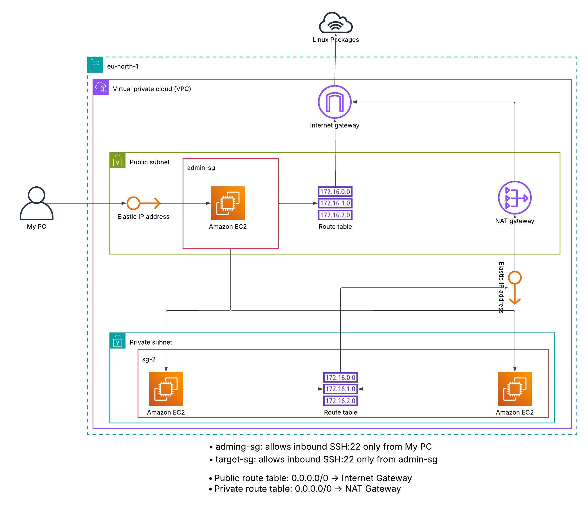

# Linux Infrastructure & Hardening Lab
Video: https://lnkd.in/p/eQRAQxHU

A practical Linux administration project combining **AWS, Terraform, Ansible, and Bash** to provision, configure, harden, and troubleshoot Linux systems.

The project uses **Ansible and Bash as two different implementations of the same modular Linux hardening workflow**, targeting both RHEL and Debian systems.

---

## Architecture (TESTING AREA)



> **Architecture diagram placeholder:** `docs/architecture.png`

### AWS Infrastructure

- **Region:** `eu-north-1`
- **VPC:** `10.0.0.0/16`
- **Public Subnet:** `10.0.1.0/24`
  - Linux Admin EC2
  - NAT Gateway
- **Private Subnet:** `10.0.2.0/24`
  - RHEL Target EC2
  - Debian Target EC2
- Internet Gateway
- NAT Gateway
- Public/private route tables
- Elastic IPs
- Security Groups

The Linux Admin instance acts as the **Ansible control node** and management host for the target systems.

---

## Project Structure

```text
.
├── Terraform/
│   ├── main.tf
│   ├── variables.tf
│   ├── outputs.tf
│   └── terraform.tfvars
│
├── Ansible/
│   ├── hardening.yml
│   ├── inventory.ini
│   └── roles/
│       ├── baseline/
│       ├── packages/
│       ├── users/
│       ├── ssh/
│       ├── firewall/
│       ├── services/
│       ├── permissions/
│       └── motd/
│
├── Bash/
│   ├── run_modules.sh
│   ├── collect_system_info.sh
│   └── modules/
│       ├── baseline.sh
│       ├── packages.sh
│       ├── users.sh
│       ├── ssh.sh
│       ├── firewall.sh
│       ├── services.sh
│       ├── permissions.sh
│       └── motd.sh
│
└── docs/
    └── architecture.png
```

---

# Terraform & AWS

Terraform provisions the complete AWS environment.

### Resources

- VPC
- Public subnet
- Private subnet
- Internet Gateway
- NAT Gateway
- Public route table
- Private route table
- EC2 instances
- EC2 key pairs
- Elastic IPs
- Security Groups

The architecture separates the administration host from the Linux targets.

```text
                         Internet
                            |
                     Internet Gateway
                            |
                     Public Subnet
                     /           \
                    /             \
            Linux Admin        NAT Gateway
                 |
          +------+------+
          |             |
          v             v
     RHEL Target    Debian Target
          |             |
          +------ Private Subnet ------+
```

The target machines reside in the private subnet and use the NAT Gateway for outbound internet access.

The Admin instance has an Elastic IP and is accessible through SSH from the administrator's current public IP.

---

# Linux Hardening

The core of the project is the Linux hardening automation.

The same hardening objectives are implemented twice:

```text
                    Linux Hardening
                          |
              +-----------+-----------+
              |                       |
           Ansible                  Bash
              |                       |
           Roles                   Modules
              |                       |
              +-----------+-----------+
                          |
                    Linux Targets
                     /         \
                   RHEL       Debian
```

This provides a direct comparison between:

- **Ansible:** declarative configuration management
- **Bash:** procedural system automation

Both implementations are modular and cover the same administration areas.

---

# Ansible

Ansible manages the target machines remotely from the Linux Admin instance.

The main playbook:

```bash
ansible-playbook -i inventory.ini hardening.yml
```

## Ansible Roles

| Role | Purpose |
|---|---|
| `baseline` | Collect system and network baseline information |
| `packages` | Install and manage required packages |
| `users` | Configure users and administrative groups |
| `ssh` | Configure and harden SSH |
| `firewall` | Configure host firewall rules |
| `services` | Enable and manage required services |
| `permissions` | Apply filesystem permission controls |
| `motd` | Configure the system MOTD |

Distribution-specific behavior is handled using Ansible facts and conditional tasks.

For example:

- RHEL → `dnf`, `firewalld`, `sshd`, `httpd`
- Debian → `apt`, `ufw`, `ssh`, `apache2`

---

# Bash

The Bash implementation performs the **same hardening workflow locally** using modular shell scripts.

The main script acts as the entry point and executes the required modules.

```text
harden.sh
    |
    +── modules/baseline.sh
    |
    +── modules/packages.sh
    |
    +── modules/users.sh
    |
    +── modules/ssh.sh
    |
    +── modules/firewall.sh
    |
    +── modules/services.sh
    |
    +── modules/permissions.sh
    |
    +── modules/motd.sh
```

The modular design keeps individual hardening areas isolated while allowing the entire hardening process to be executed through one entry point.

The script also supports options such as:

```bash
sudo ./harden.sh
sudo ./harden.sh --dry-run
sudo ./harden.sh --verbose
sudo ./harden.sh --auto-upgrade
sudo ./harden.sh --only ssh
```

---

# Ansible vs Bash

Both implementations solve the same problem:

| Hardening Area | Ansible | Bash |
|---|---|---|
| Baseline | Role | Module |
| Packages | Role | Module |
| Users | Role | Module |
| SSH | Role | Module |
| Firewall | Role | Module |
| Services | Role | Module |
| Permissions | Role | Module |
| MOTD | Role | Module |

The difference is primarily **how the automation is expressed and executed**.

Ansible provides remote, declarative configuration management, while Bash provides direct procedural control over the operating system.

---

# Troubleshooting

A major part of the project involved troubleshooting real service and configuration failures.

## Nginx / Apache Port Conflict

During service deployment, Nginx failed to start with:

```text
nginx: [emerg] bind() to 0.0.0.0:80 failed (98: Address already in use)
nginx: [emerg] bind() to [::]:80 failed (98: Address already in use)
```

Nginx configuration validation itself succeeded:

```text
nginx: configuration file /etc/nginx/nginx.conf test is successful
```

This indicated that the problem was not the Nginx configuration syntax.

The next step was to identify which process was already listening on port 80:

```bash
ss -ltnp
```

Service status and logs were also inspected:

```bash
systemctl status nginx
journalctl -xeu nginx
```

The issue was caused by **Apache/httpd and Nginx both attempting to use port 80**.

The project was subsequently simplified to use **Nginx** rather than running Apache and Nginx simultaneously.

This demonstrated an important troubleshooting principle:

> A service can have a valid configuration and still fail because another process is already using a required resource.

Other issues encountered during development included:

- Debian and RHEL using different package names
- `ssh` vs `sshd`
- `apache2` vs `httpd`
- `ufw` vs `firewalld`
- Services that do not support `reload`
- Distribution-specific package repositories
- Package dependency problems
- Firewall service availability
- SSH access problems caused by changing administrator IP addresses

---

# Security Hardening

The project addresses several Linux hardening areas:

- SSH configuration
- Administrative access
- Firewall configuration
- Package management
- System updates
- Service management
- Filesystem permissions
- Authentication/auditing
- Removal of unnecessary services
- MOTD configuration

AWS security groups provide an additional network security layer.

The target security group allows SSH from the Admin security group rather than exposing the targets directly to the internet.

---

# Deployment Workflow

```text
Terraform
    |
    v
AWS Infrastructure
    |
    v
Linux Admin
    |
    +-------------------+
    |                   |
    v                   v
 Ansible              Bash
    |                   |
    +---------+---------+
              |
              v
       Linux Hardening
        /           \
      RHEL         Debian
```

### 1. Provision AWS Infrastructure

Terraform creates the networking, EC2 instances, security groups, NAT Gateway, route tables, and keys.

### 2. Access the Admin Host

The Linux Admin instance provides the management environment.

### 3. Run Ansible

```bash
ansible-playbook -i inventory.ini hardening.yml
```

### 4. Run Bash

```bash
sudo ./harden.sh
```

### 5. Verify

System state can be inspected using standard Linux administration tools:

```bash
systemctl
journalctl
ss
firewall-cmd
ufw
dnf
apt
```

---

# Technologies

- **AWS**
- **Terraform**
- **Ansible**
- **Bash**
- **Linux**
- **RHEL**
- **Debian**
- **Nginx**
- **SSH**
- **systemd**
- **firewalld**
- **UFW**

---

# Project Goals

This project demonstrates practical experience with:

- AWS infrastructure provisioning
- VPC networking
- Public/private subnet architecture
- NAT Gateway configuration
- EC2 administration
- Linux system administration
- Cross-distribution management
- Infrastructure as Code
- Configuration management
- Bash automation
- Linux security hardening
- SSH administration
- Firewall management
- Service management
- Log analysis
- Troubleshooting real Linux service failures
- Building modular automation
